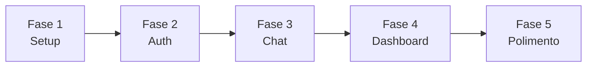
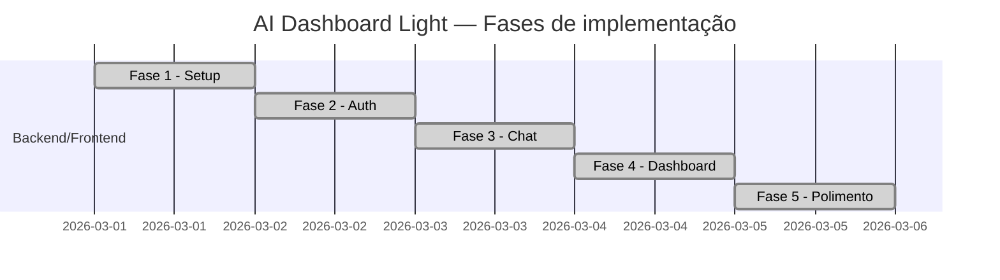
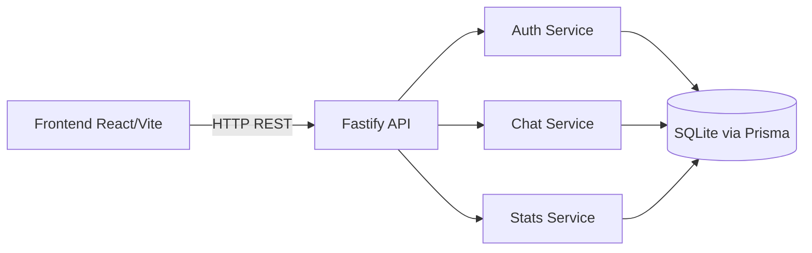
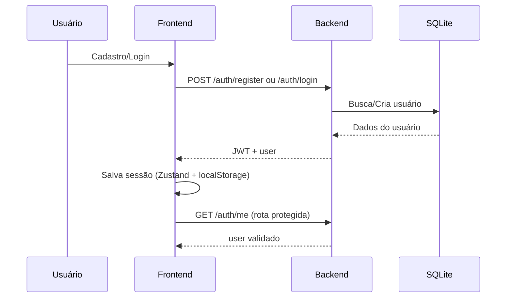
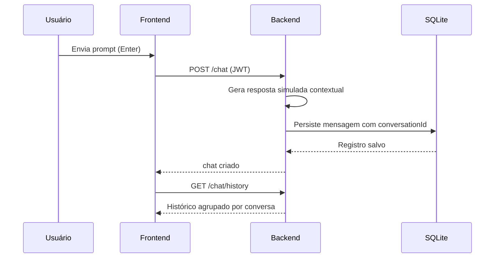

# AI Dashboard Light

Dashboard fullstack com autenticação JWT, chat com persistência, histórico por conversa e painel de métricas.

## Status

- [x] Fase 1 — Setup
- [x] Fase 2 — Auth
- [x] Fase 3 — Chat
- [x] Fase 4 — Dashboard
- [x] Fase 5 — Polimento

## Etapas do Projeto

### Visão sequencial das fases



### Linha de execução por fase



### Fase 1 — Setup (concluída)
- Criação de backend e frontend
- Configuração Prisma + SQLite
- Configuração Tailwind
- Estrutura de pastas obrigatória
- README inicial

### Fase 2 — Auth (concluída)
- Registro e login
- JWT
- Rotas protegidas
- Persistência de sessão no frontend
- Regras de senha e validação de e-mail

### Fase 3 — Chat (concluída)
- Tela de chat funcional
- Endpoint de chat com persistência
- Histórico por conversa (thread)
- Envio com Enter e quebra com Shift+Enter
- Respostas simuladas contextuais

### Fase 4 — Dashboard (concluída)
- Cards de total de mensagens e tokens
- Média de tokens por mensagem
- Gráfico de uso em 7 dias
- Layout SaaS integrado

### Fase 5 — Polimento (concluída)
- Responsividade desktop/tablet/mobile
- Ajustes de UX e dark mode
- Loading, empty e error states
- Busca e ordenação no histórico

## Stack

### Backend
- Node.js
- Fastify
- Prisma ORM
- SQLite
- JWT

### Frontend
- Vite + React
- TailwindCSS
- shadcn/ui (base)
- Zustand
- Recharts
- Framer Motion

## Arquitetura



## Fluxo de autenticação



## Fluxo de chat



## Estrutura de pastas

```text
backend/
  prisma/
    migrations/
    schema.prisma
  src/
    config/
    controllers/
    middleware/
    prisma/
    routes/
    services/
frontend/
  src/
    components/
    hooks/
    pages/
    services/
    store/
    styles/
```

## Pré-requisitos

- Node.js 20+
- npm 10+
- Linux, macOS ou Windows

## Instalação

### 1) Backend

```bash
cd backend
cp .env.example .env
npm install
npm run prisma:generate
npm run prisma:migrate
```

### 2) Frontend

```bash
cd ../frontend
cp .env.example .env
npm install
```

## Variáveis de ambiente

### `backend/.env`

```env
PORT=3333
DATABASE_URL="file:./dev.db"
JWT_SECRET="dev-local-secret-123456"
JWT_EXPIRES_IN="7d"
CORS_ORIGIN="http://localhost:5173,http://127.0.0.1:5173"
```

### `frontend/.env`

```env
VITE_API_URL="http://localhost:3333"
```

Observação: se `VITE_API_URL` não estiver definido, o frontend tenta usar automaticamente `http://<host-atual>:3333`.

## Execução

### Terminal 1 (backend)

```bash
cd backend
npm run dev
```

### Terminal 2 (frontend)

```bash
cd frontend
npm run dev
```

Acesse: `http://localhost:5173`

## Build

```bash
cd backend
npm run prisma:generate

cd ../frontend
npm run build
```

## Endpoints

### Auth
- `POST /auth/register`
- `POST /auth/login`
- `GET /auth/me`

### Chat
- `POST /chat`
- `GET /chat/history`
- `GET /chat/:id`
- `DELETE /chat/:id`

### Dashboard
- `GET /stats`

## Regras de autenticação e senha

- E-mail deve ter formato válido
- Parte local do e-mail (antes de `@`) deve ter pelo menos 3 caracteres
- Senha deve ter:
  - mínimo 6 caracteres
  - pelo menos 1 caractere especial

## Funcionalidades implementadas

### Auth
- Cadastro
- Login
- Logout
- Rotas protegidas com JWT
- Persistência de sessão no frontend

### Chat
- Prompt com envio por `Enter`
- `Shift + Enter` para quebra de linha
- Resposta simulada contextual por tema
- Persistência por `conversationId`
- Scroll automático
- Loading/error/empty states

### Histórico
- Lista por conversa (não por mensagem isolada)
- Visualização detalhada de mensagens por conversa
- Exclusão de conversa
- Busca por título/preview
- Ordenação por recentes, mensagens ou tokens

### Dashboard
- Total de mensagens
- Total de tokens
- Média de tokens/mensagem
- Gráfico de uso nos últimos 7 dias

## Testes manuais sugeridos

1. Registrar usuário novo em `/auth`.
2. Fazer logout e login com o mesmo usuário.
3. Testar login inválido (`a@gmail.com`) e validar erro de regra.
4. Enviar prompts em `/chat` e validar respostas contextuais.
5. Validar envio com `Enter` e quebra com `Shift + Enter`.
6. Criar múltiplas mensagens no mesmo chat e validar agrupamento no `/history`.
7. Usar busca e ordenação no histórico.
8. Validar `/dashboard` com cards e gráfico atualizados.
9. Redimensionar a janela (desktop/tablet/mobile) e validar responsividade.

## Verificação rápida por cURL

```bash
curl -i http://localhost:3333/health
curl -i http://localhost:3333/auth/me
```

Esperado:
- `GET /health` -> `200`
- `GET /auth/me` sem token -> `401`

Fluxo completo:

```bash
EMAIL="qa$(date +%s)@gmail.com"
PASSWORD="abcde!1"

REGISTER=$(curl -s -X POST http://localhost:3333/auth/register \
  -H "Content-Type: application/json" \
  -d "{\"email\":\"$EMAIL\",\"password\":\"$PASSWORD\"}")

TOKEN=$(node -e "const data=JSON.parse(process.argv[1]); process.stdout.write(data.token)" "$REGISTER")

curl -i http://localhost:3333/auth/me -H "Authorization: Bearer $TOKEN"
curl -i -X POST http://localhost:3333/chat \
  -H "Content-Type: application/json" \
  -H "Authorization: Bearer $TOKEN" \
  -d "{\"prompt\":\"Preciso de um plano para estudar backend\"}"
curl -i http://localhost:3333/chat/history -H "Authorization: Bearer $TOKEN"
curl -i http://localhost:3333/stats -H "Authorization: Bearer $TOKEN"
```

## Troubleshooting

### Erro `Failed to fetch`

1. Verifique se backend está rodando na porta `3333`.
2. Verifique `frontend/.env` (`VITE_API_URL`).
3. Verifique `backend/.env` (`CORS_ORIGIN`).
4. Se estiver acessando por IP local, reinicie frontend/backend para recarregar envs.

### Porta em uso no backend

```bash
fuser -k 3333/tcp
```

### Banco desatualizado

```bash
cd backend
npm run prisma:generate
npm run prisma:migrate
```
